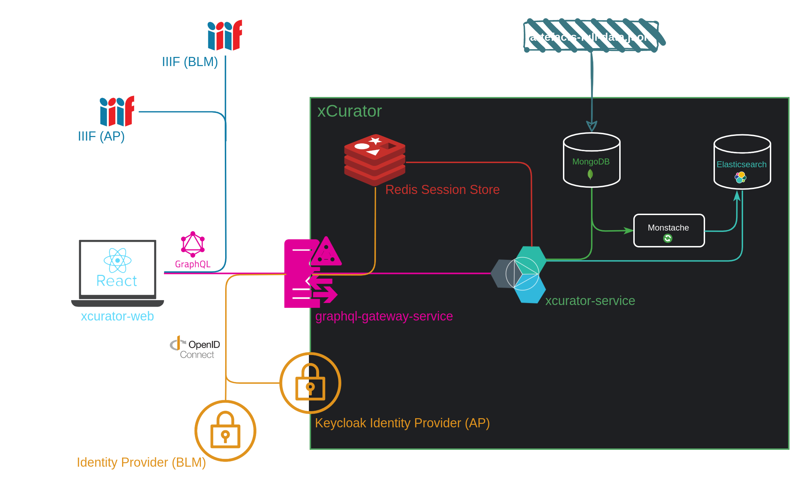

# xCurator application

This repository contains the code which is used by the web application.
Each directory is a code repository itself representing a service, a frontend, or configuration code-base.

Be aware that you may need to create the dataset first by running the [data-enrichment](../data-enrichment/README.md) before you start the application.

# Architecture
The xcurator Application is a system of multiple components, internal (included in this repo) and external (connected through standardized protocols)

Overview:

### Persistence
Primary Storage of the system is the **Mongo DB**. All data (artefacts, stories, project related user-data) is stored here.
Additional storage builds the **Elasticsearch** Search engine which is synchronized by **Monstache** in real-time. 
Any changes done on the primary storage are synchronized to the search-engine. This includes (meta) data as well as vectors (neural search).

### Identity | Access Management
This Project uses the [OpenID Connect](https://openid.net/) standard to identify and authorize users. 
In our setup we use **two** Identity providers, one for BLM (which is hosted and managed external) and on for AP which is installed and configured in this project. 
For AP we use the Open Source Identity Provider [Keycloak](https://www.keycloak.org/). The identity is checked through a JWT Token on the API Gateway of the system and creates a distributed session inside the redis storage.

### Frontend.
The Frontend is build with the TypeScript, Next.js, React - Stack. Packaged and served by an NGINX Webserver.
Communicating with the system is done using [GraphQL](https://graphql.org/) (HTTP POST) through the api of gateway of the system.
Dependent on the environment (BLM | AP) the frontend connects to the correct Identity Provider for registration and authentication.

### Backend
The Backend is done using the Java, Spring Boot - Stack. The Java Service is responsible for all client requests using GrapQL through the API Gateway and is connected to all persistence parts of the system (data and search). 
Authentication is done by reading the distributed session inside the redis storage. Additionally, the Java Service is connected to the *clip-http-service* via HTTP REST. The clip-http-service is a simple Python service to convert string search query inputs into clip embeddings of the dimension 640. This connection is optional, if the clip-http-service is not present, the java backend is not using the neural search inside the explore feature.

### External Dependencies
Three external systems are connected during runtime.
1. BLM Identity Provider: Registration and Authentication on the BLM Environment is done on that system.
2. BLM IIIF Image Server: Images of the BLM Dataset are only referenced by IIIF URLs and served by their external IIIF Server.
3. AP IIIF Image Server: Images of the AP Dataset are only referenced by IIIF URLs and served by their external IIIF Server.

