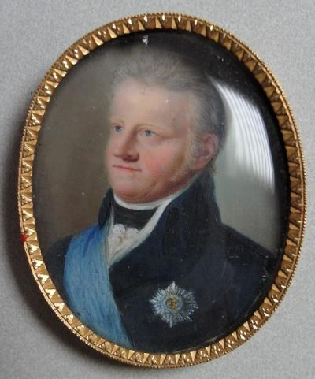
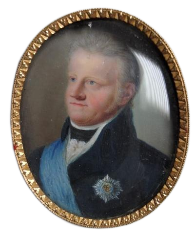
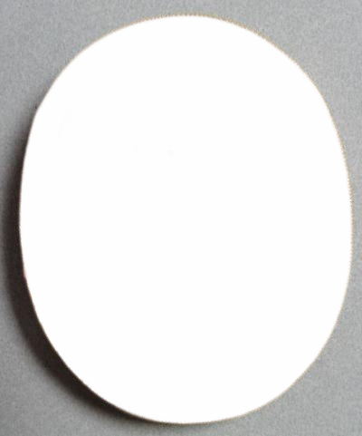

# Color extraction

**Authors**: Nadav Babai | Sören Räuchle @ [3pc GmbH](https://www.3pc.de)

This service extracting the color palette of an input image. The algorithm is handling foreground/background as well
as 'shiny' colors (colors inside the image with a high saturation value).
Additionally, the color name is classified by a given [color Excel sheet](src/resources/Farben.xlsx)
during the extraction phrase by nearest-neighbor.

### Install, Run, Test

- Install dependencies: ```poetry install```
- Install Testing dependencies: ```poetry install --with test,dev```
- Run Tests: ```poetry run pytest```

### Tech-Stack

- [Python 3.11](https://www.python.org/)
- [Poetry](https://python-poetry.org/)
- [Pytorch](https://pytorch.org/)
- [Cuda](https://developer.nvidia.com/cuda-toolkit)
- More dependencies ```pyproject.yml```
- Runtime dependencies ```docker-compose.yml```

### Local Dev Environment Requirements
- Poetry installed -> [How To](https://python-poetry.org/docs/)
- Poetry Dynamic Versioning plugin installed -> [How to](https://github.com/mtkennerly/poetry-dynamic-versioning)
- GPU preferable for inference speed [RTX 4070 | RTX 2070 | 2080 (ti) tested]
- Cuda 11.8 installed (if GPU available) ->  [How to | Linux](https://gist.github.com/Mahedi-61/2a2f1579d4271717d421065168ce6a73)

### More Info | Documentation | Papers
- [Image Segmentation U2-Net](https://github.com/xuebinqin/U-2-Net)
- [Color Palette extraction](https://github.com/fengsp/color-thief-py/blob/master/colorthief.py)
* [color palette](src/resources/Farben.xlsx)

## Example Output:

### Image


### Mask


### Foreground


### Colors Palette
-  `#2e2b2a` ratio: 31.23 name: darkslategray
-  `#967c69` ratio: 10.99 name: gray
-  `#6c5846` ratio: 8.58 name: darkolivegreen
-  `#cab6a2` ratio: 6.46 name: tan
-  `#6a787d` ratio: 4.5 name: slategray
-  `#585650` ratio: 4.35 name: dimgray
-  `#4b6478` ratio: 2.73 name: dimgray
-  `#a8aeae` ratio: 0.31 name: darkgray
-  `#9da1a5` ratio: 0.26 name: darkgray
### Shiny Color
-  `#4b6478` ratio: 2.73 name: dimgray
-  `#6c5846` ratio: 8.58 name: darkolivegreen
-  `#967c69` ratio: 10.99 name: gray

### Background


### Colors Palette
-  `#a9a9a9` ratio: 24.53 name: darkgray
-  `#362d29` ratio: 3.88 name: darkslategray
-  `#6f6d6a` ratio: 1.59 name: dimgray
-  `#c2c4bf` ratio: 0.3 name: silver
-  `#5c5350` ratio: 0.18 name: dimgray
-  `#857a77` ratio: 0.08 name: gray
-  `#978970` ratio: 0.03 name: gray
-  `#d7c6b2` ratio: 0.03 name: silver
-  `#695e4b` ratio: 0.01 name: dimgray
### Shiny Color
-  `#695e4b` ratio: 0.01 name: dimgray
-  `#978970` ratio: 0.03 name: gray
-  `#362d29` ratio: 3.88 name: darkslategray

`#FF0000`