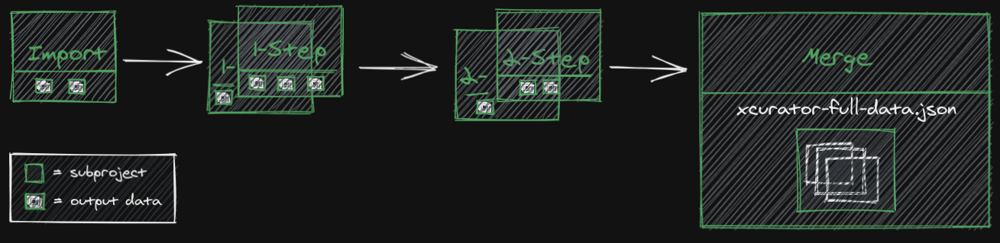

# xCurator Data Enrichment Pipeline

This [sub-folder](../data-enrichment) contains all data related and enrichment related subprojects (indicated by the number prefix) to import and prepare the data which is **required** to run the [xCurator application](../application).

The Data Enrichment Pipeline is a queue of multiple steps. Each step is creating new information except the last step, which combines everything to a single dataset in the JSON Format.

The final JSON dataset is a list of artefacts. The Artefact Schema is described as [JSON Schema](https://json-schema.org/) here: [artefact-schema.json](./artefact-schema.json)

**Subproject Naming Convention:** `[SEQUENCE_NUMBER]-[SUBPROJECT_NAME]`

- **SEQUENCE_NUMBER**: Prefix sequence numbers on the folders indicates the required execution sequence. Same numbers can be executed in parallel if necessary.
- **SUBPROJECT_NAME**: the name of the project, step of enrichment

## Pipeline Steps

#### 0. Import ([0-artefact-core-import](./0-artefact-core-import))

The first step is to fetch and download the core data (artefacts). Artefacts are museum objects and represent real world objects.
based on the given apis, this step is fetching, cleaning, filtering and normalizing the data to build a **list of artefacts**.
Additionally, this step downloads all artefact images, fetching **width** and **height** information, and convert them as base64 images to enable faster image enrichment's for later steps.

#### 1. Translation ([1-translation](./1-translation))

The target of this step is to make sure that the core textual data used by the search engine and displayed to end users is available for all languages used in the project. 

#### 1. object color ([1-artefact-object-color](./1-artefact-object-color))

The target of this step is to retrieve the color information of the artefact object itself. To make this work, this step is doing Ai image-segmentation to segment the object inside the image from the background.
Having the segmented object image, the pixels are clustered to create a color palette of the artefact.

For detailed info see here: [1-artefact-object-color/README](./1-artefact-object-color/README.md)
